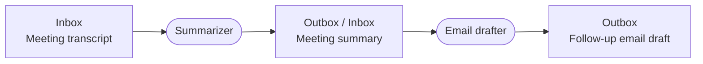
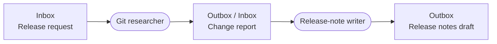
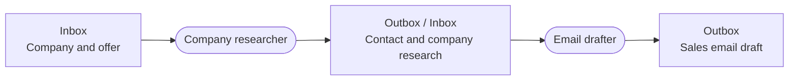

# 🐹 Hamster

**A native Mac GUI for AI workers, packed into one single shell script.**

No installer, server, or third-party libraries.

Give it an inbox, an outbox, and a prompt. Drop a file into the inbox. Hamster runs your AI CLI and puts the results in the outbox.

Hamsters are composable. Connect one worker's outbox to another's inbox to chain tasks.

Requires macOS 12+ and an installed, authenticated Gemini (`agy` or `gemini`), Claude (`claude`), or Codex (`codex`) CLI. Hamster uses your existing CLI authentication and adds no extra dependencies.

| A single worker                                                                                    | A colony                                                            |
| -------------------------------------------------------------------------------------------------- | ------------------------------------------------------------------------------ |
|  |  |

## How a script becomes a GUI

The Bash launcher uses macOS's built-in JavaScript for Automation and Cocoa to create the interface. The GUI and worker logic live in the same `.command` file.

The source file is the file you run. Inspect it yourself or ask your coding agent to adapt it, then relaunch. There is no build step or separate app bundle.

## Get started

1. Double-click [`main.colony/hamster-founder/hamster.command`](main.colony/hamster-founder/hamster.command).
2. In **Settings**, choose your AI backend. Add `.md` prompt files to `instructions/`, `.md` skill files to `skills/`, and executable `.sh` tool files to `tools/`.
3. Click **Start Hamster** and drop files into `input/`.
4. Collect the results from `output/`.

Hamster processes one file at a time and removes successfully processed inputs. Keep a copy of any originals you need. You can change both folder paths in Settings.

Failed runs produce files with a timestamped `.error` suffix. Workers ignore these files, so errors do not pass down a chain.

## Colonies and breeding

Open [`main.colony/colony.command`](main.colony/colony.command) to manage the workers in that colony. Each Hamster can also run independently.

- **Breed Hamster** in a worker, or **Breed** in a colony, creates a new `hamster-<id>/` folder in the same colony.
- **Breed Colony** creates a sibling `colony-<id>.colony/` folder containing one new worker.

Breeding copies instructions, tools, and skills, and creates empty input and output folders. Review the new worker's settings before starting it. Each colony controls only its own workers.

## Files in a Hamster

Each worker keeps its files together:

```text
hamster-founder/          # Bred workers use hamster-<id>/
    hamster.command
    input/
    output/
    instructions/
        prompt.md
    skills/
    tools/
    .hamster/            # Runtime settings and logs
```

Hamster combines non-hidden files in the selected instructions folder in filename order when it opens. The default is `./instructions`. Relaunch after editing instruction files directly.

Add scripts to `tools/` and skill guides to `skills/`, or select other folders in Settings.

Git ignores local instructions, tools, skills, queue contents, and runtime data. It also ignores additional workers in `main.colony/` and sibling `*.colony/` folders. Already tracked files remain tracked.

## Workflows built from folders

Set one worker's **Outbox** and the next worker's **Inbox** to the same folder. Each handoff needs a unique filename and all the context the next worker needs. Workers sharing an inbox compete for files; each file goes to one worker.

Configure these examples with prompts and folder settings. Agents can use Git, web lookup, SSH, and local scripts through your AI CLI. Provide the tools, credentials, and file access each task needs.

### 1. Meeting follow-up

The summarizer turns a transcript into a file with decisions, action items, owners, and deadlines. The drafter uses that summary to write a follow-up email for review.



### 2. Release notes

Provide a file naming the repository, commit range, and audience. The researcher uses Git to write a change report with commit references. The writer turns that report into release notes.



### 3. Outbound sales email drafts

Provide a company, its website, and your offer. The researcher finds a relevant contact and writes a file with the offer, findings, sources, and missing information. The drafter uses it to write a personalized email for you to review and send.



### 4. Automated Obsidian indexing

Drop in copies of PDFs, notes, webpages, images, or recordings. The normalizer uses configured extraction tools to write Markdown with source details. The indexer reads that file, updates notes, tags, links, and the index in your Obsidian vault, then writes a receipt to its outbox.


Use one indexer per vault and instruct it to update existing notes when it encounters a source again.

## Development

Run `node tests/colonies.cjs` on macOS to verify registration, breeding, and colony controls. Node is needed only for the tests.
