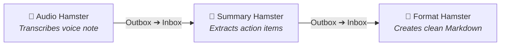
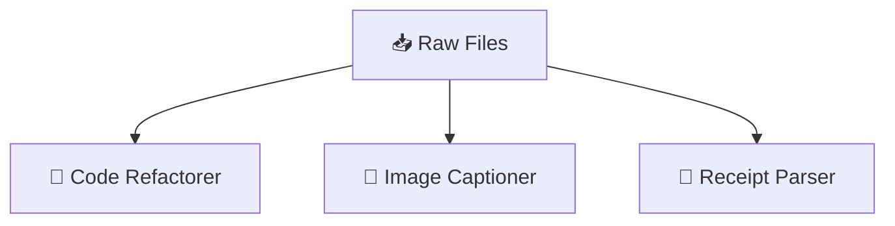
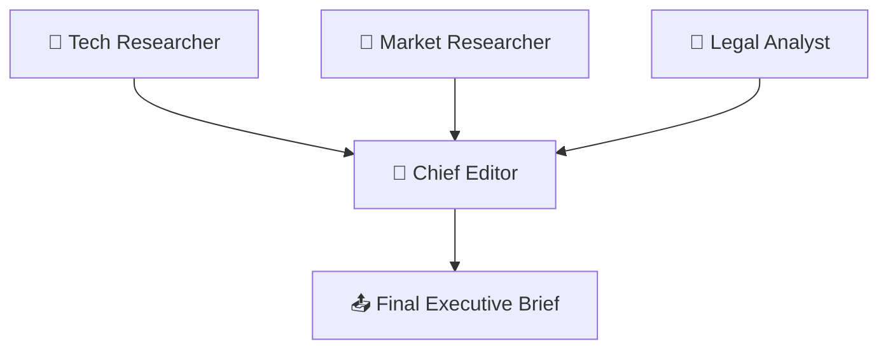
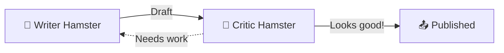

# 🐹 Hamster

**Hamster** is a tiny, self-contained worker for macOS that turns your folders into an automated AI assembly line.

Give a Hamster an **Inbox**, an **Outbox**, and some instructions. Whenever you drop a file into the inbox, the Hamster wakes up, processes it using your local AI CLI (**Gemini**, **Claude**, or **Codex**), and deposits the finished work into the outbox.

No servers, no web apps, no Python environments to break. Just double-click and let them run on their wheel.

---

## 🌻 How It Works

1. **Double-click `hamster.command`**: A lightweight Mac window appears and sets up its own cozy home folder at `~/Hamsters/`.
2. **Hit `▶ Start Hamster`**: The Hamster starts watching its inbox.
3. **Drop files in `inbox`**: PDFs, code snippets, notes, images—whatever you want processed.
4. **Collect results in `outbox`**: The Hamster picks up files one by one, does the work, and places the final files in the outbox.

If something fails, the Hamster puts your input file safely back in the inbox so nothing gets lost.

---

## 🔑 How Authentication & Credentials Work

Hamsters **never ask for or store API keys**. Instead, they piggyback directly on the command-line tools you already use on your Mac:

- **Google Gemini (`agy` / `gemini`)**: Uses your active login from `agy auth login` or the Antigravity desktop app (or `GEMINI_API_KEY` from your shell).
- **Anthropic Claude (`claude`)**: Uses your active session from `claude login` (Claude Code CLI) or `ANTHROPIC_API_KEY`.
- **OpenAI Codex (`codex`)**: Uses your local Codex configuration or `OPENAI_API_KEY`.

If a tool works when you type its command in your terminal, it works instantly inside Hamster. No secret keys are ever saved to the Hamster script or its configuration files.

---

## 🧭 Managing Your Colony: `habitat.command`

When you have multiple Hamsters running and don't want floating windows cluttering your screen, double-click **`habitat.command`**.

It gives you a single, minimalist command deck for your entire fleet:

- **Decoupled Architecture**: Hamsters can chew on their queues quietly in the background without their windows staying open.
- **Fleet Controls**: Click **`▶ Start All`** or **`⏹ Stop All`** to pause or resume processing across all workers in one click.
- **Per-Hamster Toggles**: Hit **`▶ Start`** or **`⏹ Stop`** on any individual card to control that specific worker.
- **Open Window On Demand**: Click **`🖥 Window`** on any card to bring up its full configuration screen whenever you want to inspect logs or adjust prompts.
- **Instant Breeding**: Click **`✨ Breed`** to spawn a new Hamster into your habitat immediately.

---

## 🏗️ Chaining Hamsters: Building Workflows

The real fun starts when you link Hamsters together. Because every Hamster just reads and writes to regular Mac folders, you can build any workflow by pointing one Hamster's **Outbox** to another Hamster's **Inbox**.

### 1. The Assembly Line
Chain Hamsters sequentially to handle multi-step tasks.

### 2. The Specialist Crew
Send different files to dedicated Hamsters with tailored skills and prompts.

### 3. The Editorial Board
Several researcher Hamsters dump findings into the inbox of an Editor Hamster, who combines everything into a single briefing.

### 4. The Quality Inspector (Feedback Loop)
A creator Hamster drafts content, and a critic Hamster checks the quality before passing it to production.

---

## ✨ Breeding: Instant Duplication

Need another worker for a different job? Click **`✨ Breed Hamster`** on the wheel or in the Habitat.

A fresh `hamster-<id>.command` is generated in the same directory and boots up instantly with its own dedicated home, inbox, outbox, and settings. No copy-pasting code or manual configuring required.

---

## ⚙️ Customizing Your Hamster

Flip to the **⚙️ Settings** tab on any Hamster to teach it new tricks:

- **Hamster Home**: Where this Hamster's folders live (full path).
- **Input & Output**: Change the folders it watches and outputs to.
- **AI Backend**: Choose between **Gemini (`agy`)**, **Claude (`claude`)**, or **Codex (`codex`)**.
- **Prompt Template**: Tell the Hamster exactly what to do with the files it receives.
- **Tools & Skills**: Point to folders containing scripts or skill guides the AI should use while working.

---

## 🧰 Requirements

- macOS 12.0+
- Any one (or more) of the following CLI tools installed:
  - **Google Gemini / Antigravity CLI** (`agy` or `gemini`)
  - **Anthropic Claude Code CLI** (`claude`)
  - **OpenAI Codex CLI** (`codex`)
