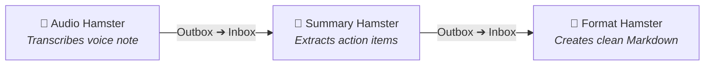
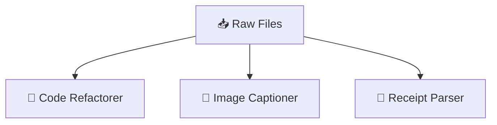
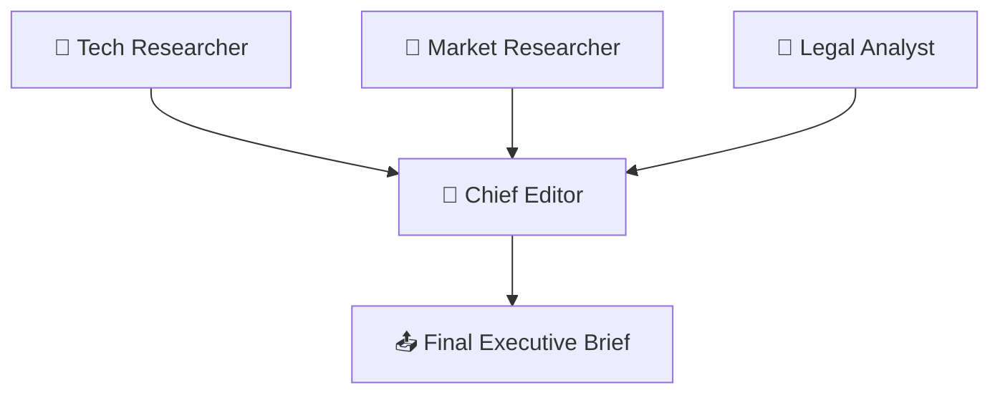

# 🐹 Hamster

**A native Mac GUI for AI workers, packed into one shell script.**

No installer. No server. No third-party libraries. Double-click [`hamster.command`](hamster.command) to open the native interface, configure a worker, and start processing files.

Give it an inbox, an outbox, and a prompt. Drop a file into the inbox. Hamster runs your AI CLI and puts the results in the outbox. Connect one worker's outbox to another's inbox to chain tasks.

**Requires macOS and an installed, authenticated Gemini, Claude, or Codex CLI.** Hamster adds no dependencies beyond those tools and what ships with macOS.

## How a script becomes a GUI

The Bash launcher runs macOS's built-in JavaScript for Automation through `osascript`. That JavaScript calls Cocoa to create native windows and controls. The interface, settings, folder monitoring, and worker logic all live in the same `.command` file.

There is no build step or separate app bundle. The source file is the file you run, so you can inspect the whole application before launching it.

The optional [`habitat.command`](habitat.command) provides a separate native window for managing multiple workers. Each Hamster runs on its own without it.

---

## 🌻 How It Works

1. **Double-click `hamster.command`**: A native Mac window opens with worker controls and settings.
2. **Hit `▶ Start Hamster`**: The Hamster starts watching its inbox.
3. **Drop files in `inbox`**: PDFs, code snippets, notes, images—whatever you want processed.
4. **Collect results in `outbox`**: The Hamster picks up files one by one, does the work, and places the final files in the outbox.

If something fails, the Hamster puts your input file safely back in the inbox so nothing gets lost.

---

## 🔑 How Authentication & Credentials Work

Hamsters **never ask for or store API keys**. Instead, they piggyback directly on the command-line tools you already use on your Mac:

- **Google Gemini (`agy` / `gemini`)**: Uses your active login from `agy auth login` or the Antigravity desktop app (or `GEMINI_API_KEY` from your shell).
- **Anthropic Claude (`claude`)**: Uses your active session from `claude login` (Claude Code CLI) or `ANTHROPIC_API_KEY`.
- **OpenAI Codex (`codex`)**: Uses your local Codex configuration or `OPENAI_API_KEY`.

If a tool works when you type its command in your terminal, it works instantly inside Hamster. No secret keys are ever saved to the Hamster script or its configuration files.

---

## 🧭 Managing Your Colony: `habitat.command`

When you have multiple Hamsters running and don't want floating windows cluttering your screen, double-click **`habitat.command`**.

It provides controls for all your workers in one window:

- **Background processing**: Hamsters keep processing their queues without their windows staying open.
- **Fleet Controls**: Click **`▶ Start All`** or **`⏹ Stop All`** to pause or resume processing across all workers in one click.
- **Per-Hamster Toggles**: Hit **`▶ Start`** or **`⏹ Stop`** on any individual card to control that specific worker.
- **Open Window On Demand**: Click **`🖥 Window`** on any card to bring up its full configuration screen whenever you want to inspect logs or adjust prompts.
- **Instant Breeding**: Click **`✨ Breed`** to spawn a new Hamster into your habitat immediately.

---

## 🏗️ Chaining Hamsters: Building Workflows

Hamsters read and write regular Mac folders. Point one Hamster's **Outbox** to another Hamster's **Inbox** to pass results to the next worker.

### 1. The Assembly Line
Chain Hamsters sequentially to handle multi-step tasks.

### 2. The Specialist Crew
Send different files to dedicated Hamsters with tailored skills and prompts.

### 3. The Editorial Board
Several researcher Hamsters dump findings into the inbox of an Editor Hamster, who combines everything into a single briefing.

### 4. The Quality Inspector (Feedback Loop)
A creator Hamster drafts content, and a critic Hamster checks the quality before passing it to production.

---

## ✨ Breeding: Instant Duplication

Need another worker for a different job? Click **`✨ Breed Hamster`** on the wheel or in the Habitat.

A new `hamster-<id>.command` is generated in the same directory and launches with its own home, inbox, outbox, and settings.

---

## ⚙️ Customizing Your Hamster

Open the **⚙️ Settings** tab to configure a worker:

- **Hamster Home**: Where this Hamster's folders live (full path).
- **Input & Output**: Change the folders it watches and outputs to.
- **AI Backend**: Choose between **Gemini (`agy`)**, **Claude (`claude`)**, or **Codex (`codex`)**.
- **Prompt Template**: Tell the Hamster exactly what to do with the files it receives.
- **Tools & Skills**: Point to folders containing scripts or skill guides the AI should use while working.

---

## 🧰 Requirements

- macOS 12.0+
- Any one (or more) of the following CLI tools installed:
  - **Google Gemini / Antigravity CLI** (`agy` or `gemini`)
  - **Anthropic Claude Code CLI** (`claude`)
  - **OpenAI Codex CLI** (`codex`)
