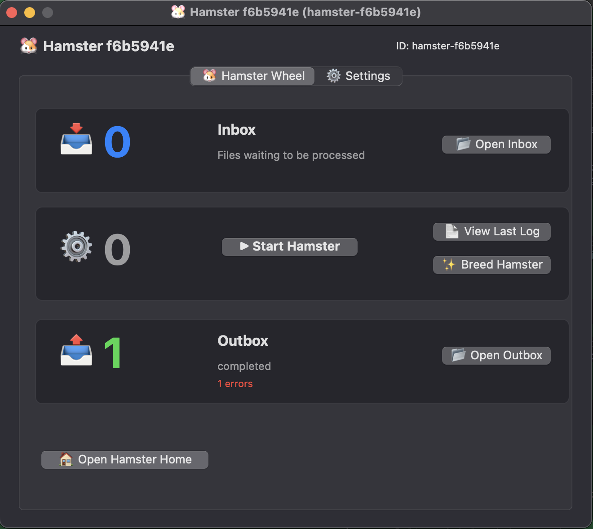
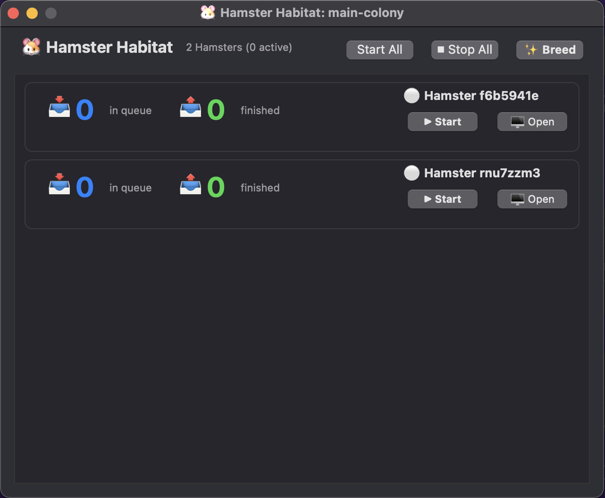
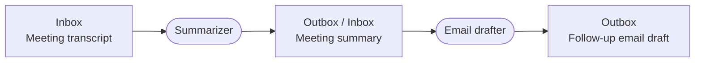
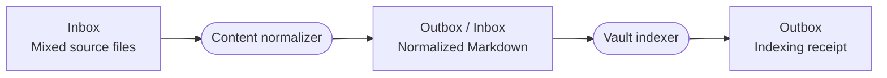

# 🐹 Hamster

**A native Mac GUI for AI workers, packed into one single shell script.**

No installer, server or third-party libraries. Open `main-colony/` and double-click [`hamster.command`](main-colony/hamster.command) to open the native interface, configure a worker, and start processing files.

Give it an inbox, an outbox, and a prompt. Drop a file into the inbox. Hamster runs your AI CLI and puts the results in the outbox.

Hamsters are composable. Connect one worker's outbox to another's inbox to chain tasks.

Requires macOS and an installed, authenticated Gemini, Claude, or Codex CLI.\*\* Hamster adds no dependencies beyond those tools and what ships with macOS.

| A single worker                                                                                    | A colony in Habitat                                                            |
| -------------------------------------------------------------------------------------------------- | ------------------------------------------------------------------------------ |
|  |  |

## How a script becomes a GUI

The Bash launcher runs macOS's built-in JavaScript for Automation through `osascript`. That JavaScript calls Cocoa to create native windows and controls. The interface, settings, folder monitoring, and worker logic all live in the same `.command` file.

There is no build step or separate app bundle. The source file is the file you run. It is easy to inspect and modify. Changes like, for example, adding support for multiple outboxes are trivial.

No rebuild or installer needed, just relaunch the script.

The optional [`habitat.command`](main-colony/habitat.command) provides a separate native window for managing the workers in its folder. Each Hamster runs on its own without it.

---

## 🌻 How It Works

1. **Double-click `hamster.command`**: A native Mac window opens with worker controls and settings.
2. **Hit `▶ Start Hamster`**: The Hamster starts watching its inbox.
3. **Drop files in `inbox`**: PDFs, code snippets, notes, images—whatever you want processed.
4. **Collect results in `outbox`**: The Hamster picks up files one by one, does the work, and places the final files in the outbox.

If something fails, the Hamster puts your input file safely back in the inbox so nothing gets lost.

---

## 🔑 How Authentication & Credentials Work

Hamsters **never ask for or store API keys**. Instead, they piggyback directly on the command-line tools you already use on your Mac:

- **Google Gemini (`agy` / `gemini`)**: Uses your active login from `agy auth login` or the Antigravity desktop app (or `GEMINI_API_KEY` from your shell).
- **Anthropic Claude (`claude`)**: Uses your active session from `claude login` (Claude Code CLI) or `ANTHROPIC_API_KEY`.
- **OpenAI Codex (`codex`)**: Uses your local Codex configuration or `OPENAI_API_KEY`.

If a tool works when you type its command in your terminal, it works instantly inside Hamster. No secret keys are ever saved to the Hamster script or its configuration files.

---

## 🧭 Managing Your Colony: `habitat.command`

When you have multiple Hamsters running and don't want floating windows cluttering your screen, double-click **`habitat.command`**.

It provides controls for all your workers in one window:

- **Background processing**: Hamsters keep processing their queues without their windows staying open.
- **Fleet Controls**: Click **`▶ Start All`** or **`⏹ Stop All`** to pause or resume processing across all workers in one click.
- **Per-Hamster Toggles**: Hit **`▶ Start`** or **`⏹ Stop`** on any individual card to control that specific worker.
- **Open Window On Demand**: Click **`🖥 Window`** on any card to bring up its full configuration screen whenever you want to inspect logs or adjust prompts.
- **Instant Breeding**: Click **`✨ Breed`** to spawn a new Hamster into your habitat immediately.

## Multiple colonies

Each folder is a colony. Its `habitat.command` lists only the Hamster scripts beside it, and **Start All** and **Stop All** apply only to those workers. The window title shows the colony folder name.

1. Duplicate the entire `main-colony/` folder in Finder.
2. Rename the copy, for example `research-colony/`.
3. Open `research-colony/habitat.command` to register its workers and manage that colony.

Copied workers get new IDs and start stopped with default settings and separate working folders. Prompts, custom paths, queued files, and credentials are not copied by this operation. Each worker uses your existing AI CLI authentication.

**Breed** creates a new script in the same colony folder. To move an existing worker or rename a colony, quit its workers first, move or rename the folder, and reopen Habitat. When the old script path no longer exists, workers keep their IDs, settings, and working folders.

Worker state remains under `~/Library/Application Support/Hamsters/<worker-id>/`. Default inboxes and outboxes remain under `~/Hamsters/Hamster_<id>/`. Colonies group scripts; moving a colony does not move those data folders.

For development, run `node tests/colonies.cjs` on macOS to check registration, copying, moving, and colony controls using temporary files and the native automation runtime. Node is only needed for this test script.

---

## Workflows built from folders

Set one Hamster's **Outbox** and the next Hamster's **Inbox** to the same folder. Every handoff below is a file in that folder. Workers process one input item at a time, so each handoff must include all the context the next worker needs. Use a unique filename for each job.

These are workflows you can configure through prompts and folder settings. Agents can use the tools available through your AI CLI, including Git, web lookup, SSH, and local scripts. Configure the required tools, credentials, and file access for each worker. Hamster itself adds no tool dependencies.

### 1. Meeting follow-up

Put a meeting transcript in the first inbox. The summarizer writes one Markdown file containing the meeting context, decisions, action items, owners, and deadlines. The email drafter turns that file into a follow-up email for you to review and send.

### 2. Release notes

Drop in a request file specifying the repository, commit range, and intended audience. The Git researcher uses Git to inspect that range and writes a change report with the request details and supporting commit references. The release-note writer uses the report to draft release notes for review.

Give the researcher access to the repository. Use a separate checkout for each worker that changes repository files.

### 3. Outbound sales email drafts

Each prospect file names a company, its website, and your product or offer. The company researcher checks public webpages to identify a relevant contact, their role, and a concrete reason the company could benefit. It writes one research file containing the offer, findings, source URLs, and any uncertainty about contact details.

The email drafter uses that file to write a personalized subject line and email for your review. Instruct it to flag missing contact information rather than invent an address. The output is a draft; sending is a separate step.

### 4. Automated Obsidian indexing

Drop copies of PDFs, notes, saved webpages, images, or recordings into the first inbox. The content normalizer uses the extraction, OCR, or transcription tools you have configured to produce one self-contained Markdown file per input, including source details. Keep originals elsewhere if you need to retain them: Hamster consumes successfully processed inputs.

The vault indexer reads each Markdown file, creates or updates a note in your configured Obsidian vault, adds tags and links, and updates an index note. It uses file tools to make those vault edits, then writes a receipt to its outbox identifying the files changed. Configure it to recognize previously indexed sources so retries update existing notes.

Give the indexer access to the vault and use one indexer per vault to avoid competing edits to the index. The vault is a separate destination edited by that agent; the receipt is its output for the Hamster workflow.

Each workflow has a dedicated inbox per stage. Workers sharing an inbox compete for files; sharing does not broadcast a file to every worker or select a specialist automatically.

---

## ✨ Breeding: Instant Duplication

Need another worker for a different job? Click **`✨ Breed Hamster`** on the wheel or in the Habitat.

A new `hamster-<id>.command` is generated in the same directory and launches with its own home, inbox, outbox, and settings.

---

## ⚙️ Customizing Your Hamster

Open the **⚙️ Settings** tab to configure a worker:

- **Hamster Home**: Where this Hamster's folders live (full path).
- **Input & Output**: Change the folders it watches and outputs to.
- **AI Backend**: Choose between **Gemini (`agy`)**, **Claude (`claude`)**, or **Codex (`codex`)**.
- **Prompt Template**: Tell the Hamster exactly what to do with the files it receives.
- **Tools & Skills**: Point to folders containing scripts or skill guides the AI should use while working.

---

## 🧰 Requirements

- macOS 12.0+
- Any one (or more) of the following CLI tools installed:
  - **Google Gemini / Antigravity CLI** (`agy` or `gemini`)
  - **Anthropic Claude Code CLI** (`claude`)
  - **OpenAI Codex CLI** (`codex`)
